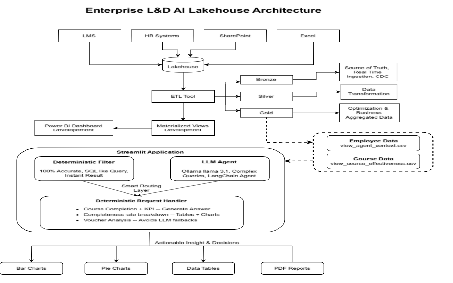
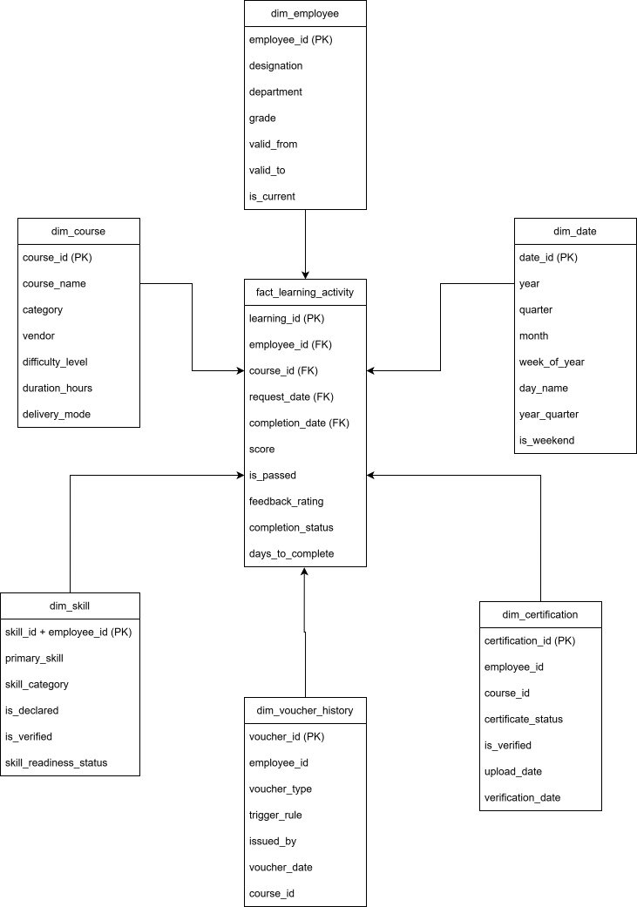

🧠 ULRA — Learning Report Agent for Unified Analytics
> An enterprise L\&D analytics platform that unifies fragmented HRMS, LMS, and SharePoint data into a governed Azure Lakehouse, then serves it through a cost-optimized hybrid AI agent — no SQL or BI training required.
Built by Team ReportRangers for the LTIMindtree x Microsoft Hack2Future hackathon.


---
📌 Problem Statement
Challenge: How can AI automate and unify learning analytics to improve workforce readiness and eliminate manual reporting?
Learning and workforce data is highly fragmented across LMS, SharePoint, Excel, and HR systems. This creates heavy manual reporting effort, delayed insights, and inconsistent metrics — leaving leadership without real-time visibility into workforce readiness.
💡 Solution
ULRA ingests all 7 source tables across 3 systems into an Azure Databricks Lakehouse, processes them through a strict Bronze → Silver → Gold Medallion Architecture, and computes 5 core workforce-readiness KPIs. A hybrid Streamlit + LangChain agent then lets L&D managers query this data in plain English — with deterministic, hallucination-free answers for known question shapes and an LLM agent for open-ended analysis, backed by cost-saving semantic caching.
🏗️ Architecture

```
LMS + HR Systems (HRMS) + SharePoint + Excel  →  Lakehouse (ADF ingestion)
        │
        ▼
  Bronze (raw, CDC)  →  Silver (transformed, cleaned)  →  Gold (Star Schema, Delta)
        │
        ▼
  Materialized Views  →  Power BI Dashboard  +  Streamlit Application
                                                       │
                                    ┌──────────────────┴──────────────────┐
                                    │                                     │
                        Deterministic Filter (Fast Data Explorer)   LLM Agent (Ollama llama3.1
                        100% accurate, SQL-like, instant                 via LangChain, for complex
                                    │                                    queries)
                                    └──────────────┬──────────────────────┘
                                            Smart Routing Layer
                                    (course-completion + KPI lookups,
                                     completeness-rate breakdowns,
                                     voucher analysis handled deterministically;
                                     everything else routed to the LLM agent)
                                                    │
                                                    ▼
                                Bar / Pie Charts · Data Tables · PDF Reports
```
Data Sources (Bronze ingestion)
Source System	Platform	Tables
HRMS	SAP SuccessFactors	`employee\_dimension` (upsert), `work\_experience` (append)
LMS	Shoshin Portal	`course\_master` (append), `learning\_transaction` (upsert)
SharePoint / Excel	L&D Tracker	`certification` (upsert), `skill\_readiness` (upsert), `training\_feedback` (append)
Gold Layer — Star Schema

Dimensions:
`dim\_employee` — SCD Type 2 (`valid\_from`, `valid\_to`, `is\_current`, `scd\_version`) to track historical role/team/manager changes
`dim\_course`, `dim\_skill`, `dim\_certification`, `dim\_date`, `dim\_voucher\_history`
Fact:
`fact\_learning\_activity` — one row per employee/course learning transaction (approval, completion, score, feedback)
Gold Views (5):
View	Purpose
`view\_employee\_kpi\_360`	Full 360° KPI profile per employee — completeness, effectiveness, engagement, skill-gap, certs
`view\_course\_effectiveness`	Course-level completion rate, pass rate, avg score, feedback rating
`view\_agent\_context\_full`	Flattened, LLM-agent-ready context per employee (feeds the Streamlit app directly)
`view\_department\_summary`	Department-level rollups of all core KPIs
`view\_voucher\_eligibility`	Voucher qualification status + priority rank per employee
All Gold tables/views use incremental MERGE statements for CDC — no full overwrites — and are exposed as Delta materialized views for sub-second query latency.
✨ Key Features
🗂️ Full Medallion pipeline — 7 source tables across 3 systems, ADF ingestion → PySpark Silver → Delta Gold Star Schema
🕒 SCD Type 2 on `dim\_employee` for full historical auditability, plus Delta Time Travel for rollback/version history
🎯 5 KPIs, 5 Gold views computed once and served via materialized views for instant reads
🔍 Fast Data Explorer — deterministic, filterable employee/course lookups with zero AI latency or hallucination risk
💬 Hybrid AI agent — a smart routing layer resolves known query shapes (course-completion lists, completeness-rate breakdowns, voucher eligibility) deterministically; anything else is handed to a LangChain `create\_pandas\_dataframe\_agent` running locally on Ollama llama3.1
🧮 Agentic execution, not hallucination — the LLM writes and runs real pandas/Python against the dataframes to compute exact numbers, rather than guessing
📊 Auto-generated charts — bar, line, scatter, histogram, and pie charts from either deterministic logic or LLM-produced chart specs, with automatic retry if a spec is malformed
📄 One-click PDF reports — every answer (table and/or chart) exportable via FPDF
🎟️ KPI-driven voucher engine — auto-qualifies learners for training vouchers using a weighted engagement score across 5 signals, with a full audit trail (`dim\_voucher\_history`)
📈 Power BI dashboard (`ReportRangers.pbix`) built directly on the Gold layer
💰 Cost-optimized — designed around LRU semantic caching to cut LLM API cost/latency on repeated queries at scale (400+ users)
🛠️ Tech Stack
Layer	Technology
Ingestion	Azure Data Factory (ADF)
Compute / Lakehouse	Azure Databricks
Storage Format	Delta Lake (CDC via MERGE, Time Travel)
Processing	PySpark
Data Modeling	Star Schema, SCD Type 2, Materialized Views
App Data Access	Pandas (Gold views exported as CSV for the app)
LLM / Agent	LangChain `create\_pandas\_dataframe\_agent`, Ollama (`llama3.1`, local)
Charting	Matplotlib
Reporting	FPDF
Frontend	Streamlit
BI	Power BI
Version Control	GitHub (Databricks–GitHub integration via PAT)
📁 Repository Structure
```
Learning-Report-Agent-for-Unified-Analytics/
├── Medallion\_architecture\_code/
│   └── Bronze/
│       ├── 01\_ingest\_hrms.ipynb              # HRMS (SAP SuccessFactors) → Bronze
│       ├── 02\_ingest\_lms.ipynb               # LMS (Shoshin Portal) → Bronze
│       ├── 03\_ingest\_sharepoint.ipynb        # SharePoint/Excel → Bronze
│       ├── 04\_bronze\_validation.ipynb        # Bronze layer validation
│       └── silver/
│           ├── 1.certification\_cleaning.ipynb
│           ├── 2.course\_master\_silver.ipynb
│           ├── 3.employee\_dimension\_cleaning.ipynb
│           ├── 4.learning\_transaction\_cleaning.ipynb
│           ├── 5.skill\_workforce\_cleaning.ipynb
│           ├── 6.training\_feedback\_cleaning.ipynb
│           ├── 7.work\_experience\_cleaning.ipynb
│           └── Gold/
│               └── gold\_layer (1).ipynb      # Star schema, SCD2, 5 Gold views
├── Gold\_FACT\_DIM\_VIEW\_TABLES/                # Exported Gold layer CSVs
│   ├── dim\_employee.csv
│   ├── dim\_course.csv
│   ├── dim\_skill.csv
│   ├── dim\_certification.csv
│   ├── dim\_date.csv
│   ├── dim\_voucher\_history.csv
│   ├── fact\_learning\_activity.csv
│   ├── view\_employee\_kpi\_360.csv
│   ├── view\_course\_effectiveness.csv
│   ├── view\_agent\_context\_full.csv
│   ├── view\_department\_summary.csv
│   └── view\_voucher\_eligibility.csv
├── Agentic\_ai\_code/
│   ├── app.py                                # Streamlit hybrid AI agent application
│   ├── prompt.txt                            # Example natural-language query
│   └── Local Setup \& Prerequisites for the Agentic AI Hub.docx
├── adf\_raw\_data\_landing\_zone/                # ADF pipeline / source-system screenshots
├── Architecture\_diagram.png
├── Star\_Schema\_Hackathon.svg
├── ER Daigram.svg
├── ReportRangers Solution PPT.pptx
├── ReportRangers.pbix                        # Power BI dashboard
└── README.md
```
🚀 Getting Started
Prerequisites
Python 3.9+
Ollama — the app runs its LLM locally via `ChatOllama(model="llama3.1")`
(For the pipeline half) an Azure Databricks workspace with a Unity Catalog and volumes configured for the HRMS/LMS/SharePoint file drops
1. Install and run Ollama
```bash
# Download Ollama from ollama.com, then:
ollama run llama3.1
```
Keep Ollama running in the background — the app connects to it locally (~4.7GB model download on first run).
2. Prepare the project folder
The app needs exactly three files in the same directory:
```
app.py
view\_agent\_context\_full.csv
view\_course\_effectiveness.csv
```
Both CSVs are already included under `Gold\_FACT\_DIM\_VIEW\_TABLES/` — copy or symlink them alongside `Agentic\_ai\_code/app.py`. If either CSV is missing, the app will stop immediately with an error.
3. Install dependencies
```bash
pip install streamlit pandas matplotlib fpdf langchain-ollama langchain-experimental
```
4. Run the app
```bash
streamlit run app.py
```
This starts a local server and opens `http://localhost:8501` in your browser.
5. (Optional) Run the Medallion pipeline
The notebooks under `Medallion\_architecture\_code/` are Databricks notebooks (`# Databricks notebook source`). Import them into a Databricks workspace with a Unity Catalog named `hackathon\_ltm` (or update the `CATALOG` variable), then run in order: `Bronze/01–04` → `Bronze/silver/1–7` → `Bronze/silver/Gold/gold\_layer`.
💬 Using the App
The Streamlit UI has two sections:
Fast Data Explorer — dropdown filters (department, manager, designation, location for employees; category, vendor, difficulty for courses) for instant, deterministic lookups
Ask the AI — a chat box for natural-language questions, e.g.:
> "List all employees who completed course Azure Data Factory Basics Lab 1, with manager, all 5 KPIs, and show a bar chart of who's eligible for a voucher."
Known query patterns (course-completion lists, completeness-rate breakdowns) are answered deterministically and instantly. Everything else is routed to the LangChain pandas agent, which writes and executes real pandas code against the data — computing exact numbers rather than guessing — and can return a chart spec and a downloadable PDF report.
👥 Team ReportRangers
Yuvraj Singh
Siyaram Sharma
Sahil Ramesh Chawla
Abhishek Damodar Bapat
Aditya Jalindar Lad
Jatin Lalit Chaudhari
🏆 Hackathon
Submitted to LTIMindtree x Microsoft Hack2Future, Solution Track.
🔮 Future Work
Migrate the application layer to Azure App Services / Azure OpenAI (architecture is already decoupled for this via materialized views)
Structured streaming ingestion (current MERGE + SCD2 design is streaming-ready)
Expand LRU semantic caching across more query patterns to further cut LLM cost/latency at scale
📄 License
[Add a license — e.g. MIT — or note if this is hackathon-only / proprietary]
